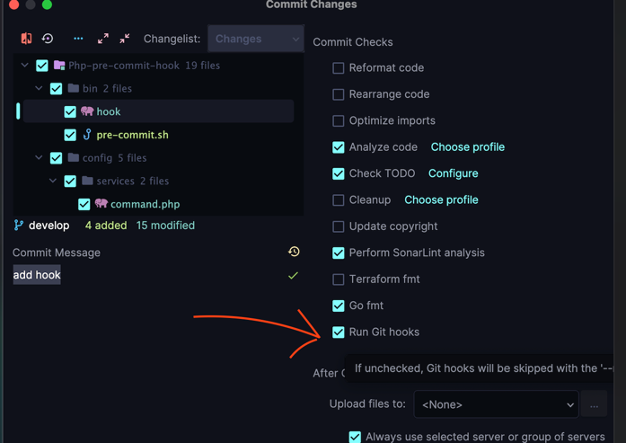

# Php git commit hooks runner

The package is a utility for git hooks configuration to speed up the work of git hooks.

Hook commands are launched in parallel and due to parallelization the hook works faster.

## Usages

* Copy config
```shell
cp vendor/sonrac/git-hook-runner/config/hook.yaml /<path-to-source-root>/<path-to-new-location-config>
```

* Edit hook configuration. Full options list see [here](docs/config-options.md)
* Create hook in `.git/hooks` directory with next content

```shell
#!/bin/sh

set -e

XDEBUG_MODE=off
set -e

XDEBUG_MODE=off

PROJECT_DIR="$(dirname ${0})/../../"

__docker_cmd_runner() {
  docker-compose exec -T -e XDEBUG_MODE=off php "$@"
}

CHANGED_FILES=$(git -C "$PROJECT_DIR" diff --staged --relative --name-only --diff-filter=ACMR)

if [ -z "$CHANGED_FILES" ]; then
  echo "Empty changed files list"
  exit 0;
fi

echo '\nRun PHPCS Beautifier:\n'

__docker_cmd_runner which ./vendor/bin/phpcbf
if [ $? -eq 1 ]; then
  echo "\033[41mPlease install PHPCS\033[0m"
  exit 1
fi

PHPCBF_OUTPUT=$(__docker_cmd_runner ./vendor/bin/phpcbf $CHANGED_FILES)

case $? in
  0)
    echo "\033[32mNothing found that could be fixed \033[0m"
    ;;
  1)
    echo "\033[32mPHPCBF fixed all fixable errors \033[0m"
    ;;
  2)
    echo "\033[43mSomething failed to fix. Please change your files \033[0m"
    exit 1
    ;;
esac

BEAUTIFIED_FILES=$(echo "$PHPCBF_OUTPUT" | grep 'src\|tests\|app' |  awk -v pr_dir="$PROJECT_DIR" '{print pr_dir$1}' | tr -s '\r\n' ' ');

if [ ! -z "$BEAUTIFIED_FILES" ]; then
  git add $BEAUTIFIED_FILES
fi

php ../../vendor/bin/hook hook -p  <path-to-source-root> -c <path-to-new-location-config> $CHANGED_FILES
```

* Save hook file content
* Git execute rights for git hook

```shell
chmod +x .git/hook/<git-hook-file-name>
```

## Disable hook for commit

Uncheck checkbox in commit modal dialogue 
if you need commit without hook runner checks



## Usefully Links

* [Hook runner overview](docs/overview.md)
* [Hook runner config](docs/config-options.md)
